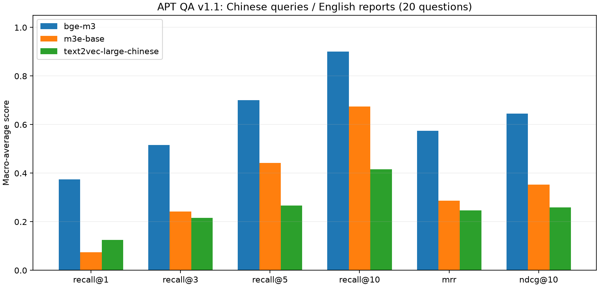

# Phase 4：Embedding 对比实验

本阶段比较 BGE-M3、text2vec-large-chinese 和 m3e-base 的真实检索结果。核心接口 `EmbeddingProvider` 仅约束归一化 float32 向量输出，实验使用 NumPy 精确搜索，便于后续替换模型和数据库。

## 固定变量与版本

配置位于 `configs/embedding_benchmark.json`：15 篇报告、1,297 个既有 Chunk、20 个中文问题、空查询前缀、L2 归一化、余弦相似度、Top-K 为 1/3/5/10、batch_size=8、max_seq_length=256、CPU float32。保留各模型原生 tokenizer 和池化，它们属于模型组成部分。模型权重固定到完整 revision，Python 依赖由 `uv.lock` 锁定。

统一 token 上限不代表统一文本覆盖长度：不同 tokenizer 的截断位置不同。此次结果代表 256-token 预算下的模型比较，不代表 BGE-M3 长上下文能力上限。原始 1,200 字符 Chunk 不改动。全部模型使用同一份 Benchmark v1.1；该版仅补齐两道题的证据引用，未改变问题与答案。

采用 CPU 是因为当前 uv 环境安装了 CPU PyTorch；主机虽有 RTX 2060 6 GB，本次未使用 GPU。编码顺序串行；首次全语料编码耗时分别保留，加载耗时会受下载/磁盘缓存影响，不用它排名模型。

## 指标与实测

- Recall@K：前 K 个结果中命中的已标注相关 Chunk 数 / 该问题的全部已标注相关 Chunk 数，随后对问题做宏平均。不同于 Hit@K。
- MRR：在整个 1,297 个 Chunk 排名中，首条相关证据排名倒数的宏平均。
- nDCG@10：gain=`2^relevance-1`，discount=`log2(rank+1)`，按理想相关性排序归一化。
- 同分时维持固定 Corpus 顺序。逐题前 10 名、分数及首条相关证据的完整排名均保存到 JSON。

| 模型 | Recall@1 | Recall@3 | Recall@5 | Recall@10 | MRR | nDCG@10 | 语料编码秒 |
|---|---:|---:|---:|---:|---:|---:|---:|
| BGE-M3 | 0.3750 | 0.5167 | 0.7000 | 0.9000 | 0.5744 | 0.6461 | 607.96 |
| m3e-base | 0.0750 | 0.2417 | 0.4417 | 0.6750 | 0.2864 | 0.3532 | 178.75 |
| text2vec-large-chinese | 0.1250 | 0.2167 | 0.2667 | 0.4167 | 0.2465 | 0.2593 | 628.17 |



预先确定的选择规则为 MRR 优先、nDCG@10 次之，因此 Phase 5 固定使用 BGE-M3。m3e-base 的编码速度更快。这里只是确定下一阶段实验的控制组件，最终系统选型属于 Phase 8。

20 题是小规模工程 Benchmark，且相关性标注并非穷尽全文；不能据此得出模型普遍优劣或统计显著性结论。问题为中文、报告为英文，结果主要反映当前 APT 跨语言任务。质量评估未使用 LLM。精确搜索时间是批量操作均摊值，非单查询延迟或数据库性能结论。

## 运行与产物

```powershell
uv sync --locked
uv run python scripts/validate_benchmark.py
uv run python scripts/run_embedding_benchmark.py
uv run python scripts/plot_embedding_results.py
uv run pytest
```

支持 `--model bge-m3`、`--model text2vec-large-chinese` 或 `--model m3e-base`。默认重新计算并覆盖对应实验产物；实验前应提交需保留的结果。`--reuse-embeddings` 校验并复用既有 Corpus 向量，重新编码查询、重算全排名与指标；结果会标记缓存复用，语料编码时间继承首次实测值，不伪装为此次重新编码。

- `results/phase4/*.json`：三个模型实测和汇总，进入 Git。
- `results/phase4/comparison.png`：由汇总结果生成的图。
- `data/processed/embeddings/*.npz`：Corpus 与 Query 向量，忽略 Git，可重建。
- 结果包含 Corpus 内容指纹、Benchmark 指纹、模型 revision、控制变量和库版本。汇总要求三模型控制变量一致。

## 官方依据

[BGE-M3 模型说明](https://huggingface.co/BAAI/bge-m3) 支持 Sentence Transformers 的 dense 编码且无需查询指令；[m3e-base 模型说明](https://huggingface.co/moka-ai/m3e-base) 提供同类接口。[text2vec-large-chinese](https://huggingface.co/GanymedeNil/text2vec-large-chinese) 为 Transformer 权重，Sentence Transformers 加载时采用 mean pooling。调用参数以[当前 SentenceTransformer API](https://sbert.net/docs/package_reference/sentence_transformer/model.html)及本地安装版本核验。
