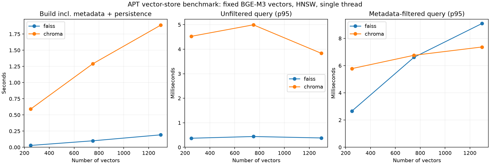

# Phase 5：向量存储对比

本阶段比较 FAISS 与 Chroma 在同一组预计算 BGE-M3 向量上的行为。`VectorStore` 接口只接收向量、Chunk ID 和 Metadata，返回 Chunk ID、余弦相似度及原始 Metadata；模型不参与建库或查询计时。新增此接口是本阶段替换后端和验证一致性所必需的。

## 控制变量

配置为 `configs/vectorstore_benchmark.json`，实测时间为 2026-10-04，环境为 Windows、Python 3.12.3、FAISS 1.15.1、Chroma 1.5.9、NumPy 2.5.3。

- 固定 Phase 4 胜出的 BGE-M3 revision、1,024 维 float32、L2 归一化向量及完全相同的 20 个查询向量。
- 两个后端均使用 HNSW 和内积；归一化向量的内积等于余弦相似度。M=16、efConstruction=100、efSearch=100、线程数=1。
- 语料顺序由 seed=42 的随机排列固定；250、750、1,297 个向量为该排列的嵌套子集。同规模下插入顺序一致。
- 每种规模、每个后端各建库 3 次，共 18 次；每次在独立 Python 进程中运行，并使用新目录。
- 每次建库后先预热一轮，再把 20 个查询随机排序运行 10 轮；每个后端/规模/查询模式累计 600 条延迟样本。
- Top-K=10，统一 Metadata 载荷（报告 ID、标题、vendor、APT group、页码、章节、URL、语言、日期、文本指纹）。原文由 Chunk ID 追溯，不重复写入这次索引载荷。
- 单字段过滤固定为 `vendor == Mandiant`；未过滤查询和过滤查询独立测量。

运行前会核验 Corpus/Benchmark 指纹、模型 revision、缓存向量维度/归一化/顺序，以及缓存查询对 Phase 4 已提交排名和分数的复现。结果记录 Corpus 与 Query 向量的 SHA-256。

HNSW 的实现和内部随机机制并不完全相同，因此对齐公共参数不保证得到相同图。Chroma 特有的持久化参数 batch_size=100、sync_threshold=100 也显式记录。实验比较的是两个本地方案，不能把结果解释为单一底层算法参数的因果效应。

## 测量口径

`build_seconds` 包含创建存储、写入所有向量和 Metadata、FAISS 索引文件/JSON 写入或 Chroma 的持久化写入与计数确认。它是应用可查询状态的端到端建库耗时，包含初始化，不是纯 HNSW 图构造耗时或断电耐久性测试。模型导入、数据加载、子进程启动和原始向量计算均不在计时内。

单查询耗时包括接口校验、后端搜索、读取 Metadata 并构造返回结果。统计报告 mean、median、p95、min、max，原始样本也保存。磁盘占用为进程结束后的目录文件大小，包括索引、Metadata、SQLite/WAL 等文件；未做压缩、压实或缓存清理，不能等同于最小备份尺寸。

`ann_recall_at_k` 是返回的前 K 个 ID 与 NumPy 精确搜索前 K 个 ID 的集合交集比例。它衡量近似检索对精确向量检索的符合程度，不等同于 QA Evidence Recall@K。边界同分时，严格 ID 比较可能处罚同样有效的替代结果。此次全部组的该指标均为 1.000。

完整语料另按相同 Ground Truth 计算 Recall@1/3/5/10、nDCG@10 和 **MRR@10**。Phase 5 只请求前 10 条，明确报告 MRR@10；Phase 4 的 MRR 使用整个 1,297 条排名，两者不可混用。子集不报告 QA Evidence Recall，避免因证据未包含在子集中而误判检索质量。

## 实测结果

| 后端 | 向量数 | 建库均值（秒） | 无过滤 p95（ms） | 过滤 p95（ms） | ANN Recall@10 |
|---|---:|---:|---:|---:|---:|
| FAISS | 250 | 0.0284 | 0.3686 | 2.6607 | 1.000 |
| Chroma | 250 | 0.5903 | 4.5253 | 5.7794 | 1.000 |
| FAISS | 750 | 0.0999 | 0.4384 | 6.6095 | 1.000 |
| Chroma | 750 | 1.2898 | 4.9940 | 6.7576 | 1.000 |
| FAISS | 1,297 | 0.1920 | 0.3800 | 9.0902 | 1.000 |
| Chroma | 1,297 | 1.8871 | 3.8323 | 7.3665 | 1.000 |



完整语料的两方案 QA 指标一致：Recall@1=0.3750，Recall@3=0.5167，Recall@5=0.7000，Recall@10=0.9000，MRR@10=0.5684，nDCG@10=0.6461。预热后同一建库中的重复查询排名稳定。

第一轮完整语料索引还在另一个全新 Python 进程中重载，核验全部 1,297 条 Metadata，并复查 20 个查询的无过滤与过滤结果及分数，两种方案均通过。重载耗时分别为约 0.0257 秒和 0.2108 秒（单次诊断，不作性能排名）。完整索引目录均值分别约 5.85 MiB 和 7.40 MiB。

## 部署、Metadata 与扩展性

| 方面 | FAISS 本地方案 | Chroma PersistentClient |
|---|---|---|
| 本阶段部署 | uv 安装 native wheel，进程内使用，无服务 | uv 安装 Chroma，使用 SQLite/本地 HNSW，无服务 |
| 存储持久化 | index.faiss + 应用管理的 metadata.json | 后端管理向量、Metadata 和持久化目录 |
| Metadata | 原库不管理报告字段；适配器维护 ID 映射和 JSON | 原生存储 Metadata 并提供 where 查询 |
| 本阶段过滤 | 扫描全部 Metadata，再对完整匹配集合重建临时 FlatIP 精确搜索 | 原生 where 过滤并搜索 |
| 工程复杂度 | 基础检索小，但 ID/Metadata、一致性、过滤需应用负责 | 依赖较多，已有 collection 和 Metadata 管理 |
| 扩展性边界 | 该适配器为单机内存索引，过滤扫描随匹配集合增加 | 此实验为单节点本地部署，尚未验证并发或分布式 |

过滤实验的两种执行路径不同，反映各自实现代价；不应把 FAISS 临时精确索引的过滤耗时视为原生 HNSW 的过滤性能。全部候选集合均参与过滤搜索，避免先取 Top-K 再过滤造成漏召回。

本机结果支持 FAISS 在无过滤查询和建库速度上有优势；在完整语料的当前过滤实现下，Chroma 的 p95 更低，且原生 Metadata 管理减少应用逻辑。250 到 1,297 个向量只是小规模增长实验，不能推断百万级、并发、GPU、服务部署或分布式能力。正式选型将在 Phase 8 综合后续实验完成。

官方接口依据：[FAISS 索引说明](https://github.com/facebookresearch/faiss/wiki/Faiss-indexes)、[FAISS 距离与余弦相似度说明](https://github.com/facebookresearch/faiss/wiki/MetricType-and-distances)、[Chroma 当前 configuration/HNSW 文档](https://docs.trychroma.com/docs/collections/configure)和[Metadata 过滤文档](https://docs.trychroma.com/docs/querying-collections/metadata-filtering)。配置使用当前 `configuration` 参数；Chroma 接收预计算向量，embedding_function=None。

## 运行和独立验证

已有 Phase 4 缓存时：

```powershell
uv sync --locked
uv run pytest
uv run python scripts/validate_vectorstore_results.py
uv run python scripts/run_vectorstore_benchmark.py
uv run python scripts/plot_vectorstore_results.py
```

新克隆仓库先运行 Phase 1 下载、Phase 2 处理与 Phase 4 三模型实验，生成完整缓存和选择结果：

```powershell
uv run python scripts/download_reports.py
uv run python scripts/process_corpus.py
uv run python scripts/validate_benchmark.py
uv run python scripts/run_embedding_benchmark.py
uv run python scripts/run_vectorstore_benchmark.py
uv run python scripts/plot_vectorstore_results.py
```

向量 Benchmark 的模型加载是延迟导入，只校验或搜索缓存不导入 PyTorch，保持核心存储实验与 Embedding 计算解耦。Phase 4 原接口保持可用。

- `results/phase5/runs.json`：18 次建库、全部查询原始样本、逐题 ID/分数/精确参考及 QA 指标。
- `results/phase5/summary.json`：汇总指标、向量/语料/问题指纹、库版本与跨进程验证结果。
- `results/phase5/comparison.png`：由汇总结果生成的图。
- `data/processed/vectorstores/phase5-*`：各次实验的独立索引目录，忽略 Git；运行时创建新目录以保留原始实验状态。再次运行会覆盖结果 JSON/PNG，应先提交需保留的结果。

测试覆盖分数方向、完整 Top-K、Metadata 返回、单/多字段过滤、无匹配、真正跨进程重载、错误维度、非归一化向量和已有目录保护。当前 Phase 5 已完成；LLM、Hybrid Retrieval、Reranker 和最终 RAG 属于后续阶段。

## 本阶段文件变更

新增 `configs/vectorstore_benchmark.json`，`src/apt_rag/vectorstore/{__init__,base,local}.py`，`src/apt_rag/evaluation/vectorstore_benchmark.py`，`scripts/{run_vectorstore_benchmark,plot_vectorstore_results,validate_vectorstore_results}.py`，`tests/test_vectorstore.py`，本文档及 `results/phase5/`。结果校验脚本从已提交的原始样本重算延迟统计、ANN Recall 和 QA 指标，不要求本地索引缓存。

修改 `pyproject.toml`、`uv.lock` 增加并锁定 FAISS/Chroma；修改 Embedding 包初始化和实验模块，使模型库延迟导入；修改 README 更新 Phase 5 状态及运行入口。
